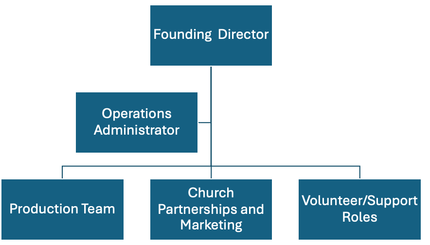

# **ChurchTech Academy**

**Equipping the Church for Excellence in Production and Worship**

---

## Prayer Statement

We pray that God would give us clear direction and practical wisdom to equip churches worldwide with production training that is accessible, free, and spiritually aligned. We believe prayer is the foundation that sustains everything we do, because it shows us what to do, when to do it, and how to do it, with excellence and the right heart. We pray this work would produce real impact in local congregations and across the Kingdom, strengthening worship and ministry with competence, order, and spiritual sensitivity.

---

## Biblical Principles

### **Stewardship**

God entrusts resources, people, and platforms to the church, and we are responsible to steward them with wisdom, clarity, and integrity. This includes stewarding technology so it serves worship rather than distracting from it.

**1 Peter 4:10**  
Each of you should use whatever gift you have received to serve others, as faithful stewards of God’s grace in its various forms. 11 If anyone speaks, they should do so as one who speaks the very words of God. If anyone serves, they should do so with the strength God provides, so that in all things God may be praised through Jesus Christ. To him be the glory and the power for ever and ever. Amen.

### **Order That Serves Edification**

Church gatherings should build people up, not create confusion. We pursue competence and reliability in production so the message and worship are clear and accessible.

**1 Corinthians 14:26**  
What then shall we say, brothers and sisters? When you come together, each of you has a hymn, or a word of instruction, a revelation, a tongue or an interpretation. Everything must be done so that the church may be built up.

### **Equipping the Saints for Ministry**

The church grows when leaders equip people, not when a few experts do everything. Our training exists to form capable volunteers and leaders who serve with confidence.

**Ephesians 4:11-13**  
So Christ himself gave the apostles, the prophets, the evangelists, the pastors and teachers, 12 to equip his people for works of service, so that the body of Christ may be built up 13 until we all reach unity in the faith and in the knowledge of the Son of God and become mature, attaining to the whole measure of the fullness of Christ.

### **Excellence With Humility**

We pursue excellence as worship unto God, while keeping servant leadership and spiritual health central so skill never replaces character.

**Philippians 2:3-4**  
2 then make my joy complete by being like-minded, having the same love, being one in spirit and of one mind. 3 Do nothing out of selfish ambition or vain conceit. Rather, in humility value others above yourselves, 4 not looking to your own interests but each of you to the interests of the others.

---

## Core Values

### **Accessibility**

Removing barriers to training by offering a free, on-demand resource.

### **Excellence**

Teaching both technical skills with depth in church production.

### **Empowerment**

Equipping volunteers and leaders to serve their churches with confidence.

### **Kingdom Impact**

Using media and technology to expand the reach of the Gospel.

---

## Vision Statement

Equipping the global church for excellence in production and worship, creating lasting impact in both local congregations and the broader Kingdom.

---

## Mission Statement

To empower churches worldwide with accessible, free, and spiritually aligned production training.

---

## Environmental Scan

### **External Environmental Scan**

#### **Churches Served by Size**

**Small Churches (under 200\)**

- Typically volunteers run with limited training and limited time.  
- High need for step by step, basic, repeatable onboarding.  
- Often cannot send teams to conferences or pay for external training.

**Medium Churches (200 to 1,000)**

- Usually have basic infrastructure but inconsistent depth across volunteers.  
- Need systems to train multiple volunteers efficiently and maintain consistency.  
- Strong need for livestream quality, audio clarity, and service reliability.

**Large Churches (1,000 plus)**

- Often have staff but constantly onboard volunteers.  
- Need standardized training libraries, role based pathways, and quality benchmarks.  
- Can influence other churches and help validate and distribute training.

#### **Scope and Reach**

- Dallas County includes over 1,500 churches.  
- Texas includes approximately 22,000 to 30,000 churches.  
- The United States includes roughly 357,000 congregations.  
- Latin America includes tens of thousands of churches, with Brazil and Mexico representing massive potential.

### **Internal Environmental Scan**

#### **Team Profile**

- **Age range:** mid 20s to mid 30s.  
- **Marital status:** about 80% married, 20% single.  
- **Gender mix:** about 83% men and 17% women.  
- **Education and experience:** mostly college level, otherwise high school plus extensive workforce experience.  
- **Cultural background:** heavy mix of Brazilian and American culture, with lived understanding of both American church contexts and Brazilian and broader Latino church contexts in the US and Latin America.  
- **Income source:** primarily ministry work, with an ability to leverage current ministry roles, relationships, and access to produce content without large upfront costs.

---

## Goals and Objectives

### **Goals**

#### **Goal 1 - Accessibility**

Remove barriers by providing free, on-demand, spiritually aligned production training that churches of any size can access and apply immediately.

#### **Goal 2 - Excellence**

Cultivate excellence in church production and worship by developing training that strengthens clarity, reliability, and service readiness in real ministry contexts.

#### **Goal 3 - Empowerment**

Equip volunteers and leaders with clear, practical training pathways that build confidence, strengthen consistency, and reduce dependency on a few key individuals.

#### **Goal 4 - Kingdom Impact**

Advance Gospel communication by helping churches use media and technology effectively in worship services, livestreams, and digital outreach.

#### **Goal 5 - Prayer**

Establish a culture of prayer and dependence on the Holy Spirit that guides the ministry's direction, protects the heart behind excellence, and sustains spiritual alignment in everything we produce and teach.

### **Objectives**

#### **Goal 1 - Accessibility Objectives**

1. **Publish a volunteer onboarding pathway**  
   Create a "Volunteer Onboarding Essentials" pathway with short, practical lessons that a new volunteer can follow without outside help.

2. **Create a clear Start Here entry map**  
   Provide a one-page training map and a simple onboarding plan so small churches know exactly where to start.

3. **Expand access for Latin America**  
   Offer Portuguese access for the first pathway and define a Spanish rollout plan so language is not a barrier.

4. **Keep access free through sending partners**  
   Build support from ministry-aligned churches or networks to cover platform and hosting costs so training stays free and sustainable.

#### **Goal 2 - Excellence Objectives**

1. **Develop platform structure**  
   Create a clear structure in the platform where all segments are separated by topics such as mixing, FOH, and worship leading, with progressive levels.

2. **Build practical readiness**  
   Create and integrate real ministry simulations and case studies so learners understand not only theory, but also how to apply it in real Sunday morning situations.

3. **Establish quality and consistency for content**  
   Implement production and theological review standards to ensure all videos meet clear audio, visual, and doctrinal quality.

4. **Build a culture of ongoing skill growth**  
   Encourage continual development by providing assessments, progress tracking, and leadership development tools.

#### **Goal 3 - Empowerment Objectives**

1. **Develop role-based training pathways**  
   Create structured, role-specific pathways with beginner, intermediate, and advanced levels so volunteers can grow step by step.

2. **Standardize ministry production processes**  
   Provide practical tools such as checklists, quick-start guides, and simple standard operating procedures that churches can immediately apply.

3. **Increase volunteer confidence and retention**  
   Integrate leadership, communication, and spiritual formation into technical training so volunteers grow in both skill and character.

4. **Implement simple progress tracking**  
   Create basic assessments and completion milestones that help leaders track development and celebrate growth.

5. **Multiply leaders**  
   Equip team leaders to mentor and reproduce new volunteers, building a sustainable leadership pipeline within church production teams.

#### **Goal 4 - Kingdom Impact Objectives**

1. **Equip church volunteers**  
   Provide practical training in audio, video, lighting, and broadcast production so volunteers can serve their churches with greater confidence and consistency.

2. **Improve Gospel communication**  
   Help churches communicate the message of Christ more clearly through better production in worship services, livestreams, and digital media.

3. **Remove financial barriers**  
   Offer free training resources so churches of all sizes, especially smaller congregations, can access professional-level production education.

4. **Expand digital outreach**  
   Equip churches to use media and technology effectively to reach people beyond the church building through online services and digital platforms.

#### **Goal 5 - Prayer Objectives**

1. **Create a prayer culture among coworkers**  
   Build a ministry environment where prayer is normal, intentional, and foundational to daily work.

2. **Establish a pastoral care and intercession framework**  
   Actively protect team unity, spiritual health, and the heart posture behind ministry excellence.

3. **Implement structured weekly prayer gatherings**  
   Gather staff and leaders regularly to seek direction and alignment before major decisions, events, and creative initiatives.

4. **Pray over students as they begin**  
   Upon gaining access to the course, students will receive a heartfelt message of encouragement over their ministry, along with a prayer.

---

## Programs and Curricula

ChurchTech Academy will use an original curriculum built by ministry practitioners with real church production experience. The curriculum will stay practical, ministry-specific, and aligned with the mission, vision, goals, and biblical principles of the ministry. Outside resources may be recommended only as hand-picked optional supplements, not as the main curriculum.

The teaching model will focus on practical application rather than theory alone. Training will be delivered through a video-based course system built around real church service situations.

### **Core Program Areas**

- Audio  
- Video and broadcast  
- Lighting  
- Worship leading and worship ministry  
- Leadership development

### **Training Levels**

1. **Beginner**  
   First-time volunteers and entry-level service roles.

2. **Intermediate**  
   Developing volunteers building consistency and stronger technical habits.

3. **Advanced**  
   Main-service volunteers carrying greater weekly responsibility.

4. **Leadership**  
   Department leaders who train teams and oversee ministry areas.

### **Supporting Programs**

- Live discussion and Q\&A livestream sessions  
- Interactive follow-up for ministry-specific questions  
- Real-time engagement around practical church production needs

---

Method and Material

ChurchTech Academy will use multiple teaching methods in order to serve different learning styles and make the training practical for real ministry teams.

### **Teaching Methods**

- **Lecture and Demonstration:** instructors will explain key production concepts while visually showing equipment, software, or workflows in action. This method is useful for core technical instruction.  
- **Video-Based Instruction:** short, well-structured visual lessons will help learners review concepts repeatedly at their own pace.  
- **Discussion and Q\&A:** lessons and live sessions will include question-driven interaction so participants can process ideas, solve ministry-specific problems, and apply principles in context.

### **Materials, Facilities, and Equipment**

To produce and deliver the training effectively, ChurchTech Academy will require the following:

- **Production equipment:** cameras, tripods, switcher access, microphones, audio interface or console access, lighting examples, and related church production gear.  
- **Teaching equipment:** laptop, presentation monitor, projector or TV screen, internet access, microphones, and presentation slides.  
- **Course materials:** lesson outlines, printable handouts, note sheets, checklists, training pathways, and certificates of completion.  
- **Facilities:** recording space, editing workspace, and access to real church production environments for demonstrations and case studies.  
- **Platform materials:** hosting infrastructure, course pages, user logins, multilingual subtitle or dubbing assets, and communication systems for subscribers.

---

## Organization and Administration

ChurchTech Academy will require a clear ministry and business structure to support content creation, platform management, instructor coordination, and church engagement. The organizational flow and key position descriptions are outlined below:

The Founding Director provides overall leadership and oversight for the ministry. The Operations Administrator reports to the Founding Director and manages the day-to-day coordination of ministry operations. The Production Team, Church Partnerships and Marketing, and Volunteer / Support Roles operate under the coordination of the Operations Administrator and function at the same organizational level.

- **Founding Director (Executive Leadership):** protects the mission, vision, and biblical alignment of the ministry while guiding major business and ministry decisions.  
- **Operations Administrator:** oversees scheduling, platform management, subscription systems, communication workflows, and administrative coordination.  
- **Production Team:** handle filming, editing, graphics, audio quality, lesson delivery standards, and technical execution.  
- **Church Partnerships and Marketing:** build relationships with churches, recruit pilot users, coordinate promotions, and gather market feedback.  
- **Volunteer / Support Roles:** assist with logistics, translation support, moderation, customer communication, and event support when needed.

---

## Evaluation

ChurchTech Academy will be evaluated on a regular basis to determine whether the platform is achieving its spiritual, educational, and organizational goals.

### **When Evaluation Will Begin**

The first evaluation will begin immediately after the pilot phase and first course releases, once enough participants have completed lessons to provide useful feedback.

### **How Often Evaluation Will Happen**

- **Weekly:** informal internal review of production quality, content progress, and workflow bottlenecks.  
- **Monthly:** review of subscriber engagement, lesson completion, church feedback, and platform performance.  
- **Quarterly:** formal evaluation of course effectiveness, strategic goals, and ministry impact.  
- **Annually:** high-level review of mission alignment, financial sustainability, curriculum growth, and expansion priorities.

### **Evaluation Tools**

- participant feedback forms  
- course completion data  
- engagement metrics such as watch time and retention  
- church partner interviews  
- team review meetings  
- financial and subscription reports

### **Who Will Be Involved**

Evaluation will involve executive leadership, operations leadership, curriculum and content leaders, selected instructors, and participating churches or users who provide direct feedback.

### **Who Will Receive the Results**

The results will be reviewed internally by leadership and shared in summary form with key team members, instructors, and strategic ministry partners as appropriate.

### **Evaluation Questions**

Key evaluation questions will include:

- Are the lessons biblically aligned and spiritually healthy?  
- Are the courses practical and clear for volunteers and church staff?  
- Are subscribers completing the training and applying it in ministry settings?  
- Which programs create the greatest impact for churches of different sizes?  
- What technical, instructional, or organizational improvements are needed next?

